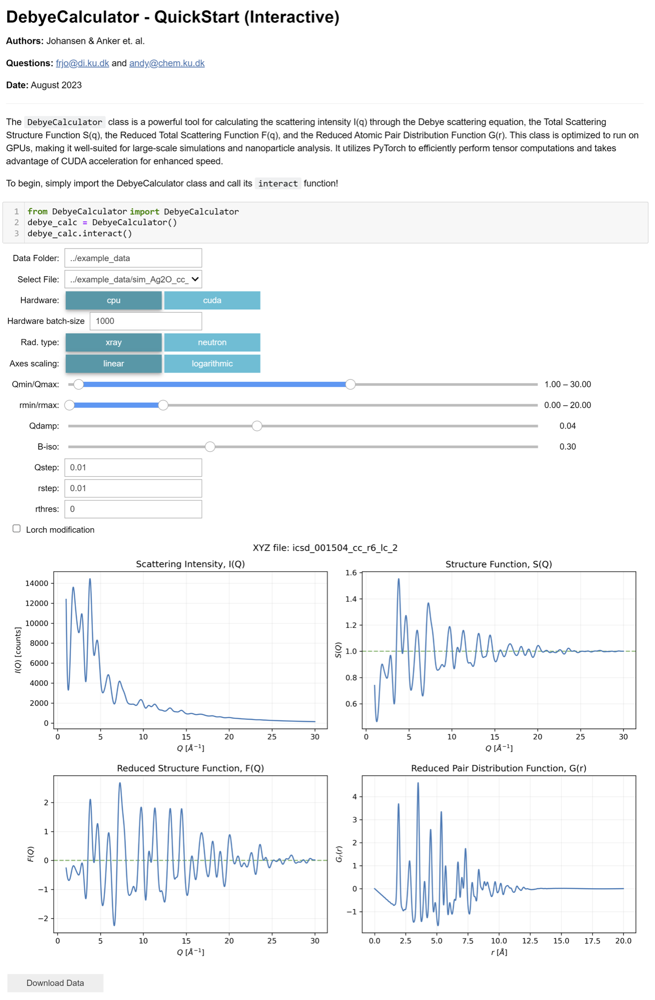

# Summary

The Debye scattering equation, derived in 1915 by Peter Debye, is used to calculate the scattering intensities considering the position of each atom in the structure:[@debye:1915; @scardi:2016]

\begin{equation}\label{eq:Debye}
I(Q) = \sum_{ν=1}^{N} \sum_{μ=1}^{N} b_ν b_μ \frac{\sin(Qr_{νμ})}{Qr_{νμ}}
\end{equation}

In this equation Q is the momentum transfer of the scattered radiation, N is the number of atoms and r~νμ~ is the distance between atoms ν and μ. For X-ray radiation, the atomic scattering factor, b, depends strongly on Q and is usually denoted as f(Q), but for neutrons b is independent of Q.
The Debye scattering equation can be used to compute the scattering pattern of any atomic structure and is commonly used to study both crystalline and non-crystalline materials with a range of scattering techniques like powder diffraction (PD), total scattering (TS) with pair distribution function (PDF) analysis and small-angle scattering (SAS).[@scardi:2016] Although the Debye scattering equation is extremely versatile, the computation of the double sum, which scales $O(N^{2})$, has limited the practical use of the equation.

With the advancement in computer hardware,[@schaller1997moore] larger structures are now feasible to analyse using the Debye scattering equation. Modern central processing Units (CPUs), ranging from tens to hundreds of cores offer an opportunity to parallelise computations, significantly enhancing compute efficiency. The same goes for Graphics processing units (GPUs), which are designed with many cores acting as individual processing units that can work on different tasks simultaneously. In contrast, CPUs usually have fewer cores optimised for more general-purpose computing. This means that a GPU can execute multiple simple instructions in parallel, while a CPU might handle fewer parallel tasks.[@garland2008parallel] Therefore, GPUs are suited for calculations such as the Debye scattering equation, where many computations can be performed simultaneously. Taking advantage of GPU acceleration yields computational speeds that surpass those of even the most advanced multi-core CPUs; by orders of magnitude. We introduce a GPU-accelerated open-source Python package, named DebyeCalculator, for rapid calculation of the Debye scattering equation from xyz-files. The xyz-format is commonly used in materials chemistry for the description of discrete particles and simply consists of a list of atomic identities and their respective Cartesian coordinates (x, y and z). We further calculate the PDF as described in Underneath the Bragg Peaks.[@egami2003underneath] We show that our software can simulate the PD, TS, SAS and PDF data orders of magnitudes faster than DiffPy-CMI.[@juhas2015complex] DebyeCalculator is an open-source project that is readily available through GitHub: https://github.com/FrederikLizakJohansen/DebyeCalculator.

The DebyeCalculator, illustrated in the following pseudocode, begins with an initialisation function that sets user-defined parameters or sets them to default. They include aspects of the computational environment (such as Q-range, Q-step, r-range, r-step, batch size, and device), atomic vibrations, radiation type, and instrumental parameters. During this initialisation phase, the calculation of the atomic form factors is prepared based on the radiation type. Once initialised, the DebyeCalculator can compute various quantities: the scattering intensity I(Q) through the Debye scattering equation, the Total Scattering Structure Function S(Q), the Reduced Total Scattering Function F(Q), and the Reduced Atomic Pair Distribution Function G(r). In this section, we specifically illustrate the pseudocode for the G(r) calculation. This is because the process for calculating G(r) inherently involves the calculations for I(Q), S(Q), and F(Q). When calling the ```gr``` function, the DebyeCalculator loads the structure and computes the atomic form factors.[@Waasmaier:sh0059] Following this, it calculates the scattering intensity I(Q) using the Debye scattering equation and subsequently determines the structure factor S(Q). The function F(Q) is derived using Q-values and S(Q). Necessary modifications, such as dampening and Lorch modifications, are applied before computing the G(r). The DebyeCalculator outputs the calculated functions to the CPU by default to allow for immediate analysis of the results, but users have the flexibility to retain the output on the GPU. 
It is worth noting that the majority of the compute time is spent on the double sum calculation in the Debye scattering equation. This is where a GPU is powerful as it has more cores to distribute the calculations to than a CPU. The double sum calculation is then multiplied by the momentum transfers and form factors. This approach is computationally inexpensive but demands significant memory, restricting the ability to calculate larger structures. Therefore, the DebyeCalculator provides a batching schema that enables users with restricted access to GPU memory to compute I(Q), S(Q), F(Q) and G(r) for larger structures, trading off only a small increase in computation time. Users with more substantial GPU memory can accommodate large structures while maintaining high computation speeds.


```plaintext
CLASS DebyeCalculator:                                                  
  FUNCTION Initialise(parameters...):
      - Set class parameters based on given input or defaults           
      - Setup computational environment (e.g., Q-values, r-values)      
      - Load atomic formfactor coefficients                             
      - Setup form factor calculation based on radiation type           
  
  FUNCTION gr(structure_path, keep_on_device=False):                
      - Load atomic structure from given structure_path                       
      - Calculate atomic formfactors                                
      - Calculate scattering intensity I(Q) (Debye scattering equation) 
      - Compute structure factor S(Q) based on I(Q)                     
      - Calculate F(Q) based on Q-values and S(Q)                       
      - Apply modifications if necessary (like dampening and Lorch)       
      - Calculate pair distribution function G(r) based on F(Q)         
      - Return G(r) either on GPU or CPU            
```

In order to benchmark our implementation, we compare simulated scattering patterns from DebyeCalculator against DiffPy-CMI,[@juhas2015complex] which is a widely recognised software for scattering pattern computations. Here, our implementation obtains the same scattering patterns as DiffPy-CMI (Supporting Information), while being faster on CPU for structures up to ~72 Å (\autoref{fig:Figure1}). Both calculations are run on a x86-64 CPU with 64GB of memory and a batch size of 10,000.
Running the calculations on the GPU provides another notable boost in speed (\autoref{fig:Figure1}). This improvement primarily stems from the distribution of the double sum calculations across a more extensive set of cores than is feasible on the CPU. With smaller atomic structures, an overhead associated with initiating GPU calculations results in the NVIDIA RTX A3000 Laptop GPU computations being slower than DiffPy-CMI and our CPU implementation. Once the atomic structure size exceeds ~14 Å in diameter, we observe a ~5 times speed-up using an NVIDIA RTX A3000 Laptop GPU with 6GB of memory and a batch size of 10,000. 
The choice of GPU hardware has a substantial influence on this speed advantage. As demonstrated in \autoref{fig:Figure1}, using an NVIDIA Titan RTX GPU, which offers 24GB of memory, the speed benefits become even more evident. The NVIDIA Titan RTX GPU delivers a performance that is ~10 times faster, seemingly across all structure sizes, underlining the significant role of the hardware. With the advancements of GPUs like NVIDIA's Grace Hopper Superchip,[@NVIDIA] which boasts 576GB of fast-access to memory, there is potential for DebyeCalculator to achieve even greater speeds in the future.

![Computation-time comparison of the G(r) calculation using our CPU- and GPU-implementation against DiffPy-CMI.[@juhas2015complex] For the CPU-implementation, a batch size of 10,000 was chosen (x86-64 CPU with 6GB). Conversely, the GPU implementations were run with a batch size of 10,000 (NVIDIA RTX A3000 Laptop GPU with 6GB of memory and NVIDIA Titan RTX GPU with 24GB of memory).\label{fig:Figure1}](../figures/Figure1.png)

# Statement of need

Several software packages already exist for simulating the Debye scattering equation, including DiffPy-CMI,[@juhas2015complex] debyer,[@debyer] Debussy,[@cervellino2010debussy; @cervellino2015debussy] TOPAS,[@coelho2018topas] and BCL::SAXS.[@putnam2015bcl] Our software distinguishes itself in several ways. Firstly, it is freely available and open-source licensed under the Apache License 2.0. Moreover, it is conveniently implemented as a ‘pip’ install package and has been integrated with Google Colab[https://github.com/FrederikLizakJohansen/DebyeCalculatorGPU/blob/main/quickstart/QuickStart.ipynb], allowing users to rapidly calculate the Debye scattering equation without the need of local software installations. DebyeCalculator can be run on both CPU, GPU and through an interactive interface (see \autoref{fig:Figure2}), where users can calculate I(Q), S(Q), F(Q) and G(r) from structural models with one click.



# Acknowledgements

This work is part of a project that has received funding from the European Research Council (ERC) under the European Union’s Horizon 2020 Research and Innovation Programme (grant agreement No. 804066).

# Supporting Information

![Comparison of the calculated I(Q), SAXS, F(Q) and G(r) of DebyeCalculator and DiffPy-CMI[@juhas2015complex] on a synthetic crystallographic information file describing a CoO~2~ antifluorite crystal structure.[@CIF] Note that the scattering pattern simulated with DiffPy-CMI is hidden underneath the scattering pattern simulated with DebyeCalculator.\label{fig:FigureS1}](../figures/FigureS1.png)

# References
