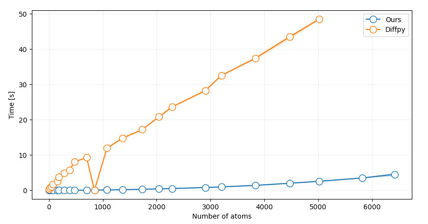
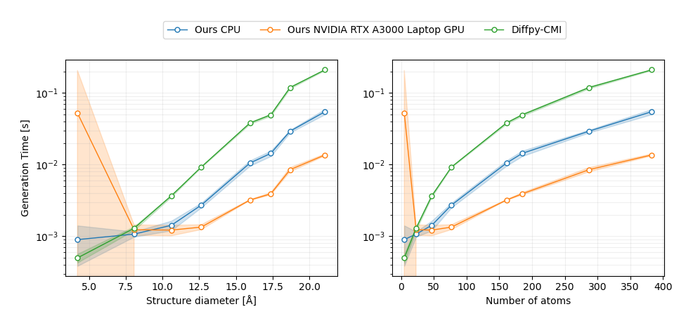

# Abstract

XXX

# Introduction

The Debye scattering equation, derived in 1915 by P. Debye, is commonly used to calculate the scattering intensities considering the position of each atom in the structure:[@debye:1915; @scardi:2016]

\begin{equation}\label{eq:Debye}
I(Q) = \sum_{i=1}^{N} \sum_{j=1}^{N} f_i(Q) f_j(Q) \frac{\sin(Qr_{ij})}{Qr_{ij}}
\end{equation}

In this equation, Q is the scattering vector, rij is the distance between atom-pair, i and j, and f is the atomic scattering factor. 
The Debye scattering equation can be used to compute the scattering pattern of any atomic structure and is commonly used to study both crystalline and non-crystalline materials with a range of scattering techniques like powder diffraction (PD), total scattering (TS) with pair distribution function (PDF) and small-angle scattering (SAS).[@scardi:2016] Although the Debye scattering equation is extremely versatile, its applicability has been limited by the double sum of the atoms in the structure which makes the equation computationally expensive to calculate. 
With the advancement in computing technology,[@schaller1997moore] new horizons have opened up for applying the Debye scattering equation to larger materials. Modern central processing Units (CPUs), ranging from tenths to hundreds of cores, offer an opportunity to parallelise the computation, significantly enhancing the computational efficiency. This parallel architecture allows for the distribution of the double sum calculations across multiple cores. Graphics processing units (GPUs) further expand computational possibilities, consisting of hundreds or even thousands of smaller, more efficient cores designed for parallel processing.[@garland2008parallel] Unlike traditional CPUs, GPUs are ideally suited for calculations like the Debye scattering equation, where many computations can be performed simultaneously. By leveraging GPU acceleration, researchers can achieve computational speeds that are orders of magnitude faster than even the most advanced multi-core CPUs.
We introduce a GPU-accelerated open-source Python package for rapid calculation of the scattering intensity from a xyz-file using the Debye scattering equation. The xyz-file format describes the atomic structure with the atomic identify and its xyz-coordinates and is commonly used in materials chemistry. We further calculate the PDF as described in Underneath the Bragg Peaks.[@egami2003underneath] We show that our software can simulate the PD, TS, SAS and PDF data orders of magnitudes faster than on the CPU, while being open-source and easy assessable by other scientists.

# Results & Discussion:

Table: Pseudo-code incl. profiling (times)

{ width=100% }
and referenced from text using \autoref{fig:figure1}.

and referenced from text using \autoref{fig:figure2}.

and referenced from text using \autoref{fig:figure3}.

# Conclusions

XXX

# Acknowledgements

XXX

# References

