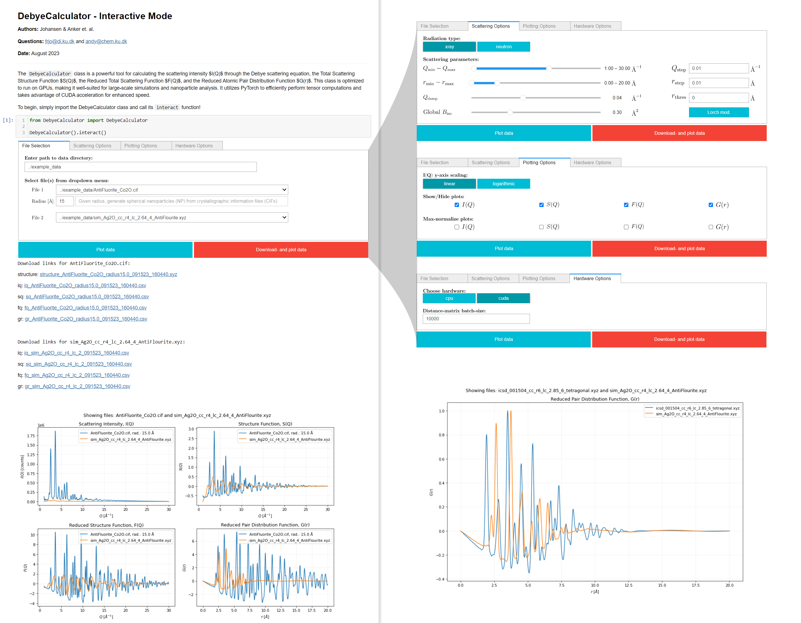

# Abstract

XXX

# Introduction

The Debye scattering equation, derived in 1915 by P. Debye, is commonly used to calculate the scattering intensities considering the position of each atom in the structure:[@debye:1915; @scardi:2016]

\begin{equation}\label{eq:Debye}
I(Q) = \sum_{i=1}^{N} \sum_{j=1}^{N} f_i(Q) f_j(Q) \frac{\sin(Qr_{ij})}{Qr_{ij}}
\end{equation}

In this equation, Q is the scattering vector, r<sub>ij</sub> is the distance between atom-pair, i and j, and f is the atomic scattering factor. 
The Debye scattering equation can be used to compute the scattering pattern of any atomic structure and is commonly used to study both crystalline and non-crystalline materials with a range of scattering techniques like powder diffraction (PD), total scattering (TS) with pair distribution function (PDF) and small-angle scattering (SAS).[@scardi:2016] Although the Debye scattering equation is extremely versatile, its applicability has been limited by the double sum of the atoms in the structure which makes the equation computationally expensive to calculate. 
With the advancement in computing technology,[@schaller1997moore] new horizons have opened up for applying the Debye scattering equation to larger materials. Modern central processing Units (CPUs), ranging from tenths to hundreds of cores, offer an opportunity to parallelise the computation, significantly enhancing the computational efficiency. This parallel architecture allows for the distribution of the double sum calculations across multiple cores. Graphics processing units (GPUs) further expand computational possibilities, consisting of hundreds or even thousands of smaller, more efficient cores designed for parallel processing.[@garland2008parallel] Unlike traditional CPUs, GPUs are ideally suited for calculations like the Debye scattering equation, where many computations can be performed simultaneously. By leveraging GPU acceleration, researchers can achieve computational speeds that are orders of magnitude faster than even the most advanced multi-core CPUs.
We introduce a GPU-accelerated open-source Python package for rapid calculation of the scattering intensity from a xyz-file using the Debye scattering equation. The xyz-file format describes the atomic structure with the atomic identify and its xyz-coordinates and is commonly used in materials chemistry. We further calculate the PDF as described in Underneath the Bragg Peaks.[@egami2003underneath] We show that our software can simulate the PD, TS, SAS and PDF data orders of magnitudes faster than on the CPU, while being open-source and easy assessable by other scientists.

# Results & Discussion:

The DebyeCalculator, illustrated in the pseudocode that follows, begins with an initialisation function that sets various parameters. These parameters are either user-defined or set to default. They include aspects of the computational environment (such as q-range, q-step, r-range, r-step, batch size, and device), atomic vibrations, radiation type, and instrumental parameters. During this initialisation phase, atomic form factor coefficients are loaded, tailoring the form factor calculation to the chosen radiation type. 
Once initialised, the DebyeCalculator can compute various quantities: the scattering intensity I(q) through the Debye scattering equation, the Total Scattering Structure Function S(q), the Reduced Total Scattering Function F(q), and the Reduced Atomic Pair Distribution Function G(r). In this section, we specifically illustrate the pseudocode for the G(r) calculation. This is because the process for G(r) inherently involves the calculations for I(q), S(q), and F(q). If the atomic structure has not been loaded, the DebyeCalculator loads the structure and computes atomic form factors. Following this, it calculates the scattering intensity I(q) using the Debye scattering equation and subsequently determines the structure factor S(q). The function F(q) is derived using q-values and S(q). Necessary modifications, such as damping and the Lorch function, are applied before computing the G(r). Users have the flexibility to retain the results on the GPU or transfer them to the CPU.
It is worth noting that the majority of the computational expense arises from the double sum calculation inherent in the Debye scattering equation.

```plaintext
CLASS DebyeCalculator:                                                  | Time |
  FUNCTION Initialize(parameters...):
      - Set class parameters based on given input or defaults           | XX ms|
      - Setup computational environment (e.g., q-values, r-values)      | XX   |
      - Load atomic formfactor coefficients                             | XX   |
      - Setup form factor calculation based on radiation type           | XX   |
  
  FUNCTION gr(structure, _keep_on_device):
      - IF structure is not already loaded THEN                         | XX   |
          - Load atomic structure from given path                       | XX   |
          - Calculate atomic formfactors                                | XX   |
      END IF
      - Calculate scattering intensity I(Q) (Debye scattering equation) | XX   |
      - Compute structure factor S(Q) based on I(Q)                     | XX   |
      - Calculate F(Q) based on q-values and S(Q)                       | XX   |
      - Apply modifications if necessary (like damping and Lorch)       | XX   |
      - Calculate pair distribution function G(r) based on F(Q)         | XX   |
      - Return G(r) either on the GPU-device or moved to CPU            | XX   |
```

DebyeCalculator produces results comparable to DiffPy-CMI[@juhas2015complex] (Appendix A), a widely recognised software for scattering pattern computations. \autoref{fig:figure2} Demonstrate the computational speed of our DebyeCalculator using CPU and GPU against DiffPy-CMI.[@juhas2015complex] While our CPU-based implementation tends to be marginally slower than DiffPy-CMI on CPU—owing to the latter's optimisation in C++—shifting our calculations to the GPU provides a notable boost in speed. This improvement primarily stems from the distribution of the double sum calculations across a more extensive set of cores than is feasible with a CPU.
It is important to note the overhead associated with initiating GPU calculations. For atomic structures with fewer than 10 atoms, this overhead results in our GPU computations being marginally slower compared to DiffPy-CMI.[@juhas2015complex] Once the atomic structure size exceeds this 10-atom threshold, we observe a speed-up using the GPU. Specifically, from XXX atoms onward, the performance gain is on the order of YYY times.
The choice of GPU hardware has a substantial influence on this speed advantage. As demonstrated in \autoref{fig:figure2}, using a KKK GPU, which offers XXX GB of RAM, the speed benefits become even more evident. Beyond the same 100-atom threshold, the KKK GPU delivers a performance that is two orders of magnitude faster, underscoring the significant role of the hardware. With the advancements of GPUs like NVIDIA's Grace Hopper Superchip[@NVIDIA], which boasts 576GB of fast-access GPU memory, there is potential for DebyeCalculator to achieve even greater speeds in the future.



and referenced from text using \autoref{fig:figure2}.


and referenced from text using \autoref{fig:figure3}.


# Conclusions

XXX

# Acknowledgements

XXX

# Appendix

DebyeCalculator achieves similar results to DiffPy-CMI[@juhas2015complex] which is commonly used software to calculate the scattering pattern. \autoref{fig:figure1} shows the I(Q), SAXS pattern, F(Q) and G(r) for DebyeCalculator and DiffPy-CMI[@juhas2015complex] simulated from XXXX.[REF where chemical CIF are from] Here, similar scattering patterns are calculated. The F(Q) and G(r) calculation are slightly different as [blablabla].

![Comparison of the calculated I(Q), SAXS, F(Q) and G(r) of our software and DiffPy-CMI[@juhas2015complex] on a chemical system of XXXX.[REF where chemical CIF are from].\label{fig:figure1}](../figures/figure1.png){width="100%"}

and referenced from text using \autoref{fig:figure1}.

# References

